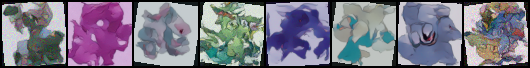
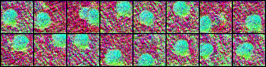

# Pokemon Neural Generation

Project to learn using neural networks to generate images.

This project uses GANs (WGAN-GP) and diffusion models (DDPM) to generate new pokemon from randomness.


# Results

(trained on a 4GB laptop GPU)


## WGAN (small)

After 5000 epochs:


Progress over epochs:


## Stable Diffusion

Result with ddim + 50 steps (ddpm not good at all)




Progress:




## Conclusion

- WGAN is noisy, even after reducing learning weights ...
- Stable diffusion gave the illusion, but still incomplete.

Other directions:

- Train a bigger model on Cloud GPU 
- Train for larger images (here only 64 x 64. Moving to 128 should be great)
- Test with another pokemon dataset

---


## Directory Structure

- `dataset/`: Pokemon image dataset
- `models/`: Model implementations
  - `WGAN_small/`: Basic WGAN-GP implementation
  - `WGAN_large/`: Enhanced WGAN-GP with larger architecture
  - `stable_diffusion/`: DDPM diffusion model
- `outputs/`: Training outputs (checkpoints, samples, losses)
  - `WGAN_small/`
  - `WGAN_large/`
  - `stable_diffusion/`

## Usage

### WGAN_small

```bash
source venv/bin/activate
cd models/WGAN_small

# Train (1000 epochs by default)
python3 train.py

# Resume from a checkpoint
python3 train.py --resume ../../outputs/WGAN_small/checkpoints/checkpoint_epoch_0500.pt

# Generate images from a trained model
python3 generate.py --checkpoint ../../outputs/WGAN_small/checkpoints/checkpoint_epoch_0950.pt --num 16
```

### WGAN_large

```bash
cd models/WGAN_large
python3 train.py
python3 generate.py --checkpoint ../../outputs/WGAN_large/checkpoints/checkpoint_epoch_1000.pt --num 64
```

### Stable Diffusion (DDPM)

```bash
cd models/stable_diffusion
python3 train.py
python3 generate.py --checkpoint ../../outputs/stable_diffusion/checkpoints/checkpoint_epoch_0500.pt --num 16
```


---


# Resources

## Papers

- Stable diffusion main paper: [High-Resolution Image Synthesis with Latent Diffusion Models, 2022](https://arxiv.org/abs/2112.10752) 
- WGAN: [Wasserstein GAN, 2017](https://arxiv.org/abs/1701.07875)

## Dataset


- [Drive](https://drive.google.com/drive/folders/1T2hF3ieas4mNBKQN6v94mlY8lbwT4KLx?usp=sharing)

(Let me know if data are no more available, this is not hosted on my gdrive account)
